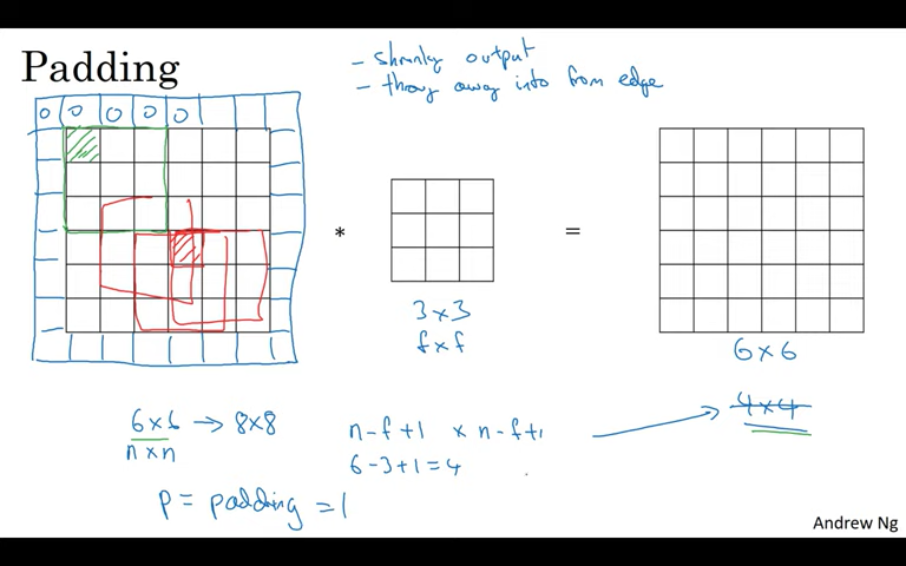

# Edge detection

We use a filter / kernel / feature map
**Transpose** of this filter gives us the edge detection of horizontal

- It is not mandatory for us to use this exact filter for edge detection
- We can instead use variables for numbers in filter
- Then find what these variables are using back propagation
- With this method, we generate filters for $\theta$ degree edge (other angles apart from 0 or 90) 

# Padding

`(n, n) conv (f, f) = (n-f+1, n-f+1)`
if we padding an image with `x` pixels extra then we get `(n+2x, n+2x)`

There are two types of padding
1. **Valid** : Basically no padding
2. **Same** : Padding is done in way that the output dimensions are same the input

If we take `p` as the padding then the output dimensions would be `(n + 2p - f + 1, n + 2p - f + 1)`
- For **Same** padding `n + 2p - f + 1 = n`, which gives `p = (f - 1) / 2`
- Here we can see that when `f` is even `p` is fractional, that means *asymmetric* padding
- Thus we mostly take **odd** filter size and also odd filters have a central pixel

# Stride
by what value `s` we move the filter each time

padding of `p` and stride of `s`
  `(n, n) conv (f, f) = (floor((n + 2p - f)/s + 1, floor((n + 2p - f)/s + 1))`
  floor($\frac{n+2p-f}{s} + 1$)

# Multiple filters

- 3rd dimension of the image and filter should be the same (no. of channel, 3 incase of RBG)
- With 3d filter, we can just detect the edges of a specific color (R or B or G) or combination of them
- At final output, we can stack multiple filter outputs

# Pooling
Pooling is a fundamental operation in Convolutional Neural Networks (CNNs) that plays a crucial role in reducing the spatial dimensions of feature maps while retaining important information. The primary purpose of pooling is to progressively reduce the spatial size of the representation to decrease the computational complexity of the network and to control overfitting. Here's a brief theory on pooling in CNN:

1. **Spatial Subsampling**: Pooling involves dividing the input feature map into non-overlapping or overlapping regions and computing summary statistics, such as max, average, or min, within each region. Max pooling is the most commonly used technique, where the maximum value within each region is retained.

2. **Dimensionality Reduction**: By performing pooling operations, the spatial dimensions (width and height) of the feature maps are reduced while preserving the depth (number of channels). This reduction helps in reducing the number of parameters and computation in subsequent layers, thus aiding in faster training and inference.

3. **Translation Invariance**: Pooling helps in achieving translation invariance to some extent. By summarizing local information, pooling allows the network to be less sensitive to small changes in the spatial location of features. For example, a specific feature detected in one region of the image should ideally be recognized regardless of its exact position within that region.

4. **Feature Generalization**: Pooling encourages feature generalization by abstracting over variations in the input. Instead of focusing on exact pixel-level details, pooling summarizes the presence of features in a larger region, making the network more robust to variations in input data such as changes in viewpoint, illumination, or noise.

5. **Down-sampling**: Pooling typically involves down-sampling the feature maps, leading to a reduction in spatial resolution. This down-sampling can be controlled through parameters such as the size of the pooling window and the stride (the step size with which the pooling window moves across the input).

6. **Choice of Pooling Operation**: While max pooling is widely used due to its effectiveness in preserving important features, average pooling and min pooling are alternative options. Average pooling computes the average value within each region, while min pooling computes the minimum value. Each pooling operation has its own characteristics and may be more suitable for specific tasks or architectures.

In summary, pooling in CNNs plays a crucial role in reducing spatial dimensions, controlling overfitting, achieving translation invariance, encouraging feature generalization, and aiding in efficient computation by down-sampling feature maps while retaining important information for effective feature extraction and representation learning.

# Why use convolution
**Parameter sharing** - A feature detector (such as a vertical edge detector) that's useful in one part of the image is probably useful in another part of the image

**Sparsity of connections** - In each layer, each output value depends only on a small number of inputs.