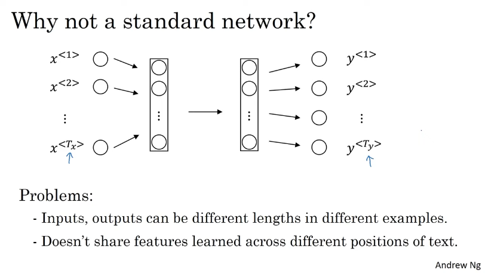
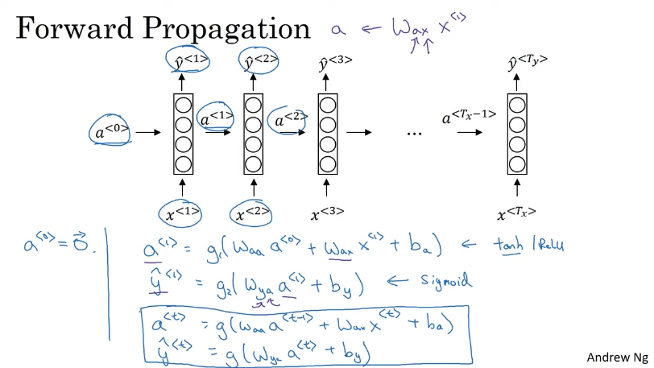
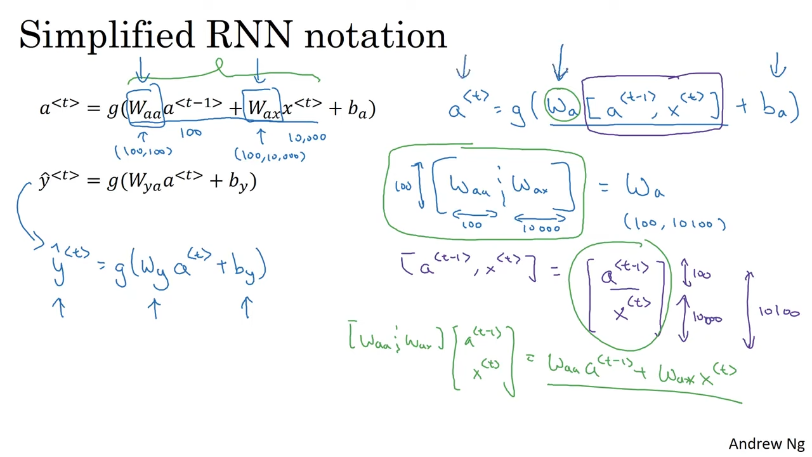
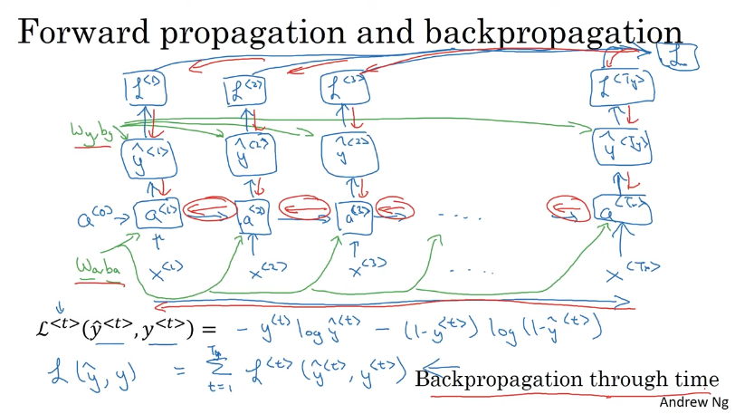

## Different RNN architectures
1. many to many
2. many to one
3. one to many

## Vanishing gradients with RNNs
with longer sequences, output at time stamp `<tx>` generally depends on some few time steps just before that, instead of depending on all the time steps before it.

## GRU (Gated Recurrent Unit)

