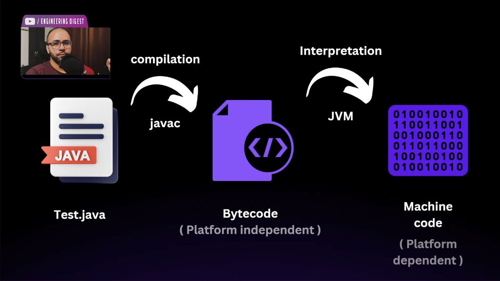
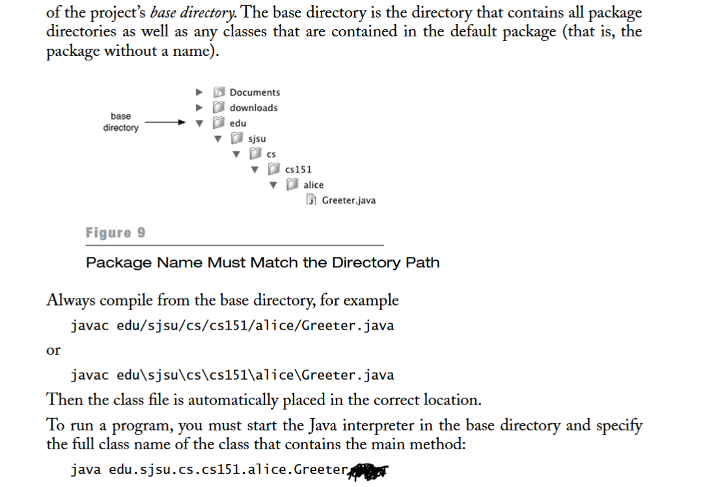

# JDK, JRE, and JVM

#### **1. JVM (Java Virtual Machine)**

- **Definition**: The JVM is a virtual machine that runs Java bytecode. It abstracts the underlying hardware and OS to provide a consistent runtime environment.
- **Role**:
    - Converts **bytecode** (compiled Java code) into **machine code**.
    - Handles memory management, garbage collection, and thread management.
- **Key Components**:
    - **Class Loader**: Loads class files.
    - **Execution Engine**: Executes bytecode instructions.
    - **Runtime Data Areas**: Includes the heap, stack, and method area.

---

#### **2. JRE (Java Runtime Environment)**

- **Definition**: A set of libraries and tools required to run Java applications.
- **Components**:
    - **JVM**: For executing Java programs.
    - **Libraries**: Core Java libraries (e.g., `java.lang`, `java.util`).
- **Use**: Needed to run Java applications but not to develop them.

---

#### **3. JDK (Java Development Kit)**

- **Definition**: A complete development environment for building and running Java applications.
- **Components**:
    - **JRE**: To execute Java programs.
    - **Development Tools**: Includes `javac` (compiler), `javadoc`, `jar`, and debugging tools.
- **Use**: Required for both developing and running Java applications.

---

#### **Relationship**

- **JVM** is part of the **JRE**, which is included in the **JDK**.
- **JDK = JRE + Development Tools**
- **JRE = JVM + Core Libraries**

This hierarchy ensures that the JDK provides everything needed for development, while the JRE is focused on running applications.



---

# Hello world
Sure! Let's break down the provided Java program step by step, explaining each keyword and component to understand how it works.

```java
class test {
	public static void main(String[] arg) {
		System.out.println("hello world!");
	}
}
```

### **1. `class`**

- **Keyword**: `class`
- **Purpose**: Declares a new class in Java.
- **Explanation**: In Java, everything revolves around classes. A class is a blueprint for creating objects (instances), and it can contain fields (variables) and methods (functions).

**Example:**

```java
class test { ... }
```

Here, `class` declares a new class named `test`.

---

### **2. `test`**

- **Identifier**: `test`
- **Purpose**: The name of the class.
- **Explanation**: `test` is the identifier given to this class. By convention, class names in Java usually start with an uppercase letter (e.g., `Test`). However, using lowercase is syntactically correct but not recommended for readability.

---

### **3. `{` and `}`**

- **Symbols**: `{` and `}`
- **Purpose**: Define the beginning and end of a class or method body.
- **Explanation**: These curly braces enclose the contents of the class and its methods, indicating the scope.

---

### **4. `public`**

- **Keyword**: `public`
- **Purpose**: Access modifier.
- **Explanation**: `public` means that the method or class is accessible from any other class. It's the highest level of access.

**In Context:**

```java
public static void main(String[] arg) { ... }
```

Here, `public` makes the `main` method accessible to the Java runtime.

---

### **5. `static`**

- **Keyword**: `static`
- **Purpose**: Indicates that the method belongs to the class rather than an instance.
- **Explanation**: `static` methods can be called without creating an object of the class. The `main` method must be `static` because it is called by the Java runtime without creating an instance of the class.

**In Context:**

```java
public static void main(String[] arg) { ... }
```

`static` allows the JVM to call `main` without instantiating the `test` class.

---

### **6. `void`**

- **Keyword**: `void`
- **Purpose**: Return type of the method.
- **Explanation**: `void` indicates that the method does not return any value.

**In Context:**

```java
public static void main(String[] arg) { ... }
```

The `main` method does not return anything, hence `void`.

---

### **7. `main`**

- **Identifier**: `main`
- **Purpose**: The entry point of the Java application.
- **Explanation**: The `main` method is where the program begins execution. It's a special method that the JVM looks for to start the application.

**Signature:**

```java
public static void main(String[] arg) { ... }
```

---

### **8. `String[] arg`**

- **Parameter**: `String[] arg`
- **Purpose**: Accepts command-line arguments.
- **Explanation**:
    - `String[]`: An array of `String` objects.
    - `arg`: The name of the parameter (can be any valid identifier, commonly `args`).

This allows the program to receive input from the command line when executed.

---

### **9. `System`**

- **Class**: `System`
- **Purpose**: Provides access to system-related resources.
- **Explanation**: `System` is a final class in the `java.lang` package. It contains several useful class fields and methods, such as `System.out`.

---

### **10. `out`**

- **Field**: `out`
- **Purpose**: Represents the standard output stream.
- **Explanation**: `System.out` is a `PrintStream` object used to output data to the console.

---

### **11. `println`**

- **Method**: `println`
- **Purpose**: Prints a line of text to the console.
- **Explanation**: `println` stands for "print line" and outputs the specified data followed by a newline character.

**In Context:**

```java
System.out.println("hello world!");
```

This line prints `hello world!` to the console.

---

### **12. `"hello world!"`**

- **String Literal**: `"hello world!"`
- **Purpose**: The actual text to be printed.
- **Explanation**: This is the message that will be displayed in the console when the program runs.

---

### **Additional Notes**

- **Naming Conventions**:
    
    - **Classes**: Should start with an uppercase letter (e.g., `Test` instead of `test`).
    - **Variables and Methods**: Should start with a lowercase letter and use camelCase (e.g., `mainMethod`).
- **Compilation and Execution**:
    
    - **Compilation**: The Java source code (`.java` file) is compiled into bytecode (`.class` file) using the `javac` compiler.
        
        ```bash
        javac test.java
        ```
        
    - **Execution**: The compiled bytecode is run on the JVM using the `java` command.
        
        ```bash
        java test
        ```
        
        This will output:
        
        ```
        hello world!
        ```
        
- **Case Sensitivity**:
    
    - Java is case-sensitive. For example, `System` and `system` are considered different identifiers.
- **Whitespace and Formatting**:
    
    - Proper indentation and formatting improve readability but do not affect the program's functionality.

---

### **Summary**

- **`class`**: Declares a new class.
- **`test`**: Name of the class.
- **`public`**: Access modifier making the method accessible from anywhere.
- **`static`**: Allows the method to be called without creating an instance.
- **`void`**: Indicates the method does not return a value.
- **`main`**: Entry point of the application.
- **`String[] arg`**: Parameter for command-line arguments.
- **`System.out.println`**: Prints output to the console.
- **`"hello world!"`**: The message to be printed.

This simple program serves as the foundational example for understanding Java's syntax and structure. As you delve deeper into Java, you'll encounter more complex concepts, but the fundamentals illustrated here will remain essential.

# Compiling java files with packages
```bash
javac ./greet/GreeterTest.java
java greet.GreeterTest
```



**Objects are basically pointers, but they are called references and java doesn't have pointers**

# Abstract classes
Yes, that's correct! The key restriction for **abstract classes** is that they **cannot be instantiated** directly, meaning you cannot create objects of an abstract class. Beyond that, they offer a lot of flexibility. Here's a breakdown:

**even if a single method is abstract, the entire class should be abstract**

---

### **Key Points about Abstract Classes**

1. **Cannot Create Objects**:  
    You cannot instantiate an abstract class directly:
    
    ```java
    abstract class Shape {
        abstract void draw();
    }
    
    // Shape shape = new Shape(); // ❌ Compilation error
    ```
    
2. **Can Have Both Abstract and Concrete Methods**:  
    Abstract classes can mix abstract methods (to enforce implementation in subclasses) with concrete methods (to provide shared functionality):
    
    ```java
    abstract class Shape {
        abstract void draw(); // Must be implemented by subclasses
        
        void describe() {     // Common implementation
            System.out.println("This is a shape.");
        }
    }
    ```
    
3. **Can Have Constructors**:  
    Abstract classes can have constructors, but these are only called when a subclass is instantiated.
    
    ```java
    abstract class Shape {
        Shape() {
            System.out.println("Shape constructor called.");
        }
    }
    
    class Circle extends Shape {
        Circle() {
            System.out.println("Circle constructor called.");
        }
    }
    
    public class Main {
        public static void main(String[] args) {
            Circle circle = new Circle();
            // Output:
            // Shape constructor called.
            // Circle constructor called.
        }
    }
    ```
    
4. **Can Have Fields (Instance Variables)**:  
    Abstract classes can have fields, and these can be used by concrete methods or passed to subclasses.
    
    ```java
    abstract class Shape {
        String color;
        Shape(String color) {
            this.color = color;
        }
        void displayColor() {
            System.out.println("Color: " + color);
        }
    }
    ```
    
5. **Can Have Static Methods**:  
    Abstract classes can define static methods, which are associated with the class and not any instance.
    
    ```java
    abstract class Shape {
        static void greet() {
            System.out.println("Welcome to Shape World!");
        }
    }
    
    public class Main {
        public static void main(String[] args) {
            Shape.greet(); // Output: Welcome to Shape World!
        }
    }
    ```
    
6. **Polymorphism with Abstract Classes**:  
    Abstract classes can be used as references to objects of their concrete subclasses.
    
    ```java
    abstract class Shape {
        abstract void draw();
    }
    
    class Circle extends Shape {
        void draw() {
            System.out.println("Drawing a circle.");
        }
    }
    
    public class Main {
        public static void main(String[] args) {
            Shape shape = new Circle(); // Polymorphism
            shape.draw();               // Output: Drawing a circle.
        }
    }
    ```
    

---

### **In Summary**

- You cannot instantiate an abstract class.
- Beyond that, you can:
    - Add concrete methods, constructors, static methods, and fields.
    - Use abstract methods to enforce rules on subclasses.
    - Leverage polymorphism with abstract class references.

Abstract classes are a versatile tool for shared functionality and enforcing structure in object-oriented programming. Would you like to dive deeper into any specific aspect?


# using decorators
### **Best Practice**

Always use the `@Override` annotation when overriding a method. It:

- Ensures correctness at compile-time.
- Makes your code more maintainable and understandable.
- Protects you from subtle bugs due to typos or signature mismatches.

# Interfaces
## Uses
- Multiple inheritance
- Abstraction

## what can we implement in interfaces
1. Abstract methods
2. Static constants
3. Static methods
4. Default methods

# Lambda functions and Comparator
they only work with **Functional interfaces** they are nothing but interfaces with only exactly one abstract method (it can have concrete methods)

```java
@FunctionalInterface
public interface Comparator<T> {
	public int comparable(T o1 ,T o2);
}

Comparator<Vector<Integer>> custom = new Comparator<Vector<Integer>>(){
		@Override
		public int compare(Vector<Integer> o1, Vector<Integer> o2) {
			return o2.get(1) - o1.get(1);
		}
	};

Comparator<Vector<Integer>> custom = (o1, o2) ->  o2.get(1) - o1.get(1);

Comparator<Vector<Integer>> custom = (o1, o2) -> {
	return o2.get(1) - o1.get(1);
};
```
All are the `custom` are same, in lambda function we don't need to write type of parameter, return if one-liner
and this also how we custom sort :)

For the code `A a = new B();` to make sense, **`A`** and **`B`** must have a specific type of relationship. Here are all the possible relationships that allow this:

---

# A a = new B();
### **1. `A` is a Superclass of `B` (Inheritance)**

- **`B` extends `A`**, meaning `B` is a subclass of `A`.
- This follows the **"is-a" relationship**: `B` is a type of `A`.
- The variable `a` of type `A` can refer to an object of class `B`.

#### Example:

```java
class A {
    void display() {
        System.out.println("In A");
    }
}

class B extends A {
    void display() {
        System.out.println("In B");
    }
}

public class Main {
    public static void main(String[] args) {
        A a = new B(); // Polymorphism
        a.display();   // Output: In B (dynamic method dispatch)
    }
}
```

- **Why it works**: `B` inherits all the properties and methods of `A`. The reference `a` can call methods defined in `A` but will execute `B`'s overridden methods at runtime.

---

### **2. `A` is an Interface, and `B` Implements `A`**

- **`B` implements `A`**, meaning `B` provides implementations for the methods declared in the interface `A`.
- This follows the **"implements" relationship**: `B` agrees to the contract defined by `A`.

#### Example:

```java
interface A {
    void display();
}

class B implements A {
    public void display() {
        System.out.println("In B");
    }
}

public class Main {
    public static void main(String[] args) {
        A a = new B(); // Interface reference to implementing class
        a.display();   // Output: In B
    }
}
```

- **Why it works**: The variable `a` of type `A` can reference any object of a class that implements the interface `A`.

---

### **3. `A` and `B` Are the Same Class**

- Here, **`A` and `B` are the same class**. This is straightforward because an object of `B` can obviously be assigned to a reference of type `B`.

#### Example:

```java
class A {
    void display() {
        System.out.println("In A");
    }
}

public class Main {
    public static void main(String[] args) {
        A a = new A(); // Reference and object are of the same type
        a.display();   // Output: In A
    }
}
```

---

### **4. `A` is an Abstract Class, and `B` Extends `A`**

- **`B` extends `A`**, where `A` is an abstract class.
- `B` provides concrete implementations for any abstract methods in `A`.

#### Example:

```java
abstract class A {
    abstract void display();
}

class B extends A {
    void display() {
        System.out.println("In B");
    }
}

public class Main {
    public static void main(String[] args) {
        A a = new B(); // Abstract class reference
        a.display();   // Output: In B
    }
}
```

- **Why it works**: An abstract class reference can point to an object of its concrete subclass.

---

### **Summary Table**

|Relationship|`A` Type|`B` Type|Key Idea|
|---|---|---|---|
|**Inheritance**|Class|Subclass|`B` inherits from `A`.|
|**Interface Implementation**|Interface|Implementing Class|`B` implements `A`.|
|**Same Class**|Class|Same Class|`B` is the same as `A`.|
|**Abstract Class Inheritance**|Abstract Class|Subclass|`B` extends the abstract class `A`.|

If `A` and `B` have none of these relationships, the code will result in a **type mismatch compilation error**.

# Static block
### **Static Block in Java**

A **static block** in Java is a block of code inside a class that is executed **once** when the class is loaded into memory. It is primarily used for **initializing static variables** or performing tasks that need to be executed before any object of the class is created or any static method is invoked.

---

### **Key Features**

1. **Execution Timing**: Runs when the class is loaded by the JVM.
2. **One-Time Execution**: Executes only once per class, regardless of the number of objects created.
3. **No Explicit Call Needed**: It is executed automatically.
4. **Purpose**: Useful for initializing **static variables** or performing setup tasks.

---

### **Syntax**

```java
class Example {
    static {
        // Code to be executed when the class is loaded
        System.out.println("Static block executed");
    }
}
```

---

### **When is the Static Block Executed?**
1. When an object of the class is created for the first time.
2. When the class is explicitly loaded using `Class.forName()`.

---

### **Example**

```java
class StaticBlockExample {
    static int num;

    // Static block
    static {
        num = 42;
        System.out.println("Static block executed, num = " + num);
    }

    public static void main(String[] args) {
        System.out.println("Main method executed");
    }
}
```

**Output**:

```
Static block executed, num = 42
Main method executed
```

---

### **Key Points**

1. A class can have **multiple static blocks**, and they execute in the order they appear.
2. Static blocks cannot access non-static members directly.
3. If the class is not loaded, the static block will not execute.

---

### **Use Cases**

- Initializing **static variables**.
- **Loading configuration settings** or external resources.
- **Logging or debugging** class loading events.

### **Limitations**

- Overusing static blocks can make code harder to read and maintain.
- Static blocks should only be used for **class-level initialization** tasks.

# Access modifier in java


## Public Class
In Java, `public class A` means that the class `A` is declared with the **`public` access modifier**. The `public` modifier determines the visibility of the class to other parts of the program.

---

### **What Does `public` Access Modifier for a Class Mean?**

1. **Accessibility**:
    
    - A `public` class is **accessible from any other class** in any package.
    - Any code can reference this class, as long as it can import the package containing the class or the class is in the same package.
2. **Usage**:
    
    - You typically declare a class as `public` when you intend it to be accessible globally, such as a library or utility class.
3. **Restrictions**:
    
    - In a Java file, **only one top-level class** can be `public`, and its name must match the file name.

---

### **Example**

```java
// File: A.java
package com.example;

public class A {
    public void greet() {
        System.out.println("Hello from class A!");
    }
}

// File: B.java
package com.other;

import com.example.A;

public class B {
    public static void main(String[] args) {
        A obj = new A(); // Accessible because A is public
        obj.greet();
    }
}
```

Here:

- Class `A` is `public`, so it is accessible in class `B`, even though they are in different packages.
- Without the `public` modifier, class `A` would only be accessible within the `com.example` package.

---

### **If a Class Is Not `public`**

If a class does not have the `public` modifier, it has **default (package-private)** visibility:

- It can only be accessed by other classes within the **same package**.
- Classes in other packages cannot use it, even if they import the package.

Example:

```java
class A {  // Default access modifier
    void greet() {
        System.out.println("Hello!");
    }
}
```

This class can only be accessed by other classes in the same package.

---

### **Summary**

- **`public` class**: Accessible anywhere, from any package.
- **Default class** (no modifier): Accessible only within the same package.


# Dynamic method dispatch
```java
class A {
    public void show() {
        System.out.println("A");
    }
}
class B extends A {
    public void show() {
        System.out.println("B");
    }
    public void config() {
        System.out.println("Config");
    }
}
public class Untitled {
    public static void main(String[] args) {
        A obj = new B();
        obj.show(); // B (run time polymorphism)
        obj.config(); // Error
    }
}
```
this is Run time polymorphism
*Dynamic method dispatch is the mechanism by which the call to an overridden method is resolved at runtime rather than compile-time. This occurs when a superclass reference variable is used to refer to a subclass object, and the overridden method is called on that reference. The method to be executed is determined based on the actual object's type, not the reference variable's type.*

# Upcasting and Downcasting
```java
class A {
    public void show1() {
        System.out.println("A");
    }
}
class B extends A {
    public void show2() {
        System.out.println("B");
    }
    public void config() {
        System.out.println("Config");
    }
}
public class Untitled {
    public static void main(String[] args) {
        A obj = (A)new B(); // Upcasting, even if we don't write (A) it will be done by compiler
        obj.show1(); // A

        B obj1 = (B) obj; // Downcasting
        obj1.show2(); // B
        obj1.config(); // Config
    }
}
```

