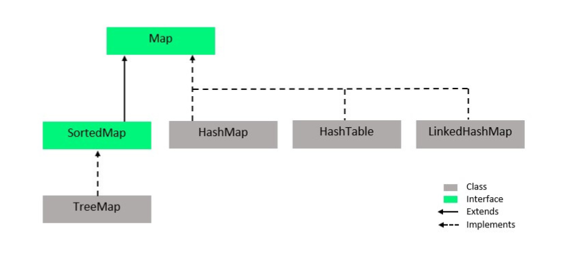

# Collections




```java
List<T> list = new ArrayList<>();
List<T> list = new Vector<>();
Set<T> set = new HashSet<>();
Set<T> set = new TreeSet<>();
```
**Normally this is done because,** 
The difference between using `A<T> list = new A<>();` versus `List<T> list = new A<>();` lies in **polymorphism** and how the code can interact with the object.

---

### **1. `A<T> list = new A<>();`**

- Here, the variable is declared with the specific type `A<T>` (e.g., `ArrayList`, `LinkedList`, `Vector`, or `Stack`).
- You can only access methods specific to `A` and not from a more general interface or superclass.
- This **ties the code to the specific implementation**, which may reduce flexibility and make future changes harder.

#### **Example**

```java
ArrayList<String> list = new ArrayList<>();
list.add("Hello");
list.ensureCapacity(50); // Specific to ArrayList
```

- If you later decide to switch to a different list implementation, such as `LinkedList`, you’ll need to rewrite the code because methods like `ensureCapacity()` do not exist in `LinkedList`.

---

### **2. `List<T> list = new A<>();`**

- Here, the variable is declared with the **interface type** `List<T>`, and the object is instantiated with a specific implementation (e.g., `ArrayList`, `LinkedList`, etc.).
- You can only access methods defined in the `List` interface, ensuring that your code adheres to the **contract defined by the interface**, not the specifics of the implementation.
- This allows you to **easily switch implementations** without modifying most of the code.

#### **Example**

```java
List<String> list = new ArrayList<>();
list.add("Hello");
// list.ensureCapacity(50); // Error: not defined in List

// Switch to LinkedList without changing the rest of the code
list = new LinkedList<>();
```

---

### **Why Use `List<T>` Instead of `A<T>`?**

#### **Advantages of `List<T> list = new A<>();`**

1. **Flexibility**:
    
    - If you want to change the list implementation later (e.g., from `ArrayList` to `LinkedList`), you only need to change the instantiation.
    - Example:
        
        ```java
        List<String> list = new ArrayList<>();
        list = new LinkedList<>();
        ```
        
2. **Polymorphism**:
    
    - You can write methods that accept `List<T>` as a parameter and work with any implementation of the `List` interface.
    - Example:
        
        ```java
        void printList(List<String> list) {
            for (String item : list) {
                System.out.println(item);
            }
        }
        ```
        
3. **Code Reusability**:
    
    - Using the interface ensures that the code is generic and not dependent on the specific implementation.

#### **Disadvantages of `List<T> list = new A<>();`**

1. **Limited Access**:
    
    - You cannot call methods specific to the implementation (e.g., `ensureCapacity()` for `ArrayList`).
2. **Less Control**:
    
    - If your code explicitly depends on the behavior of a specific implementation (e.g., fast random access in `ArrayList`), using the interface might obscure this detail.

---

### **When to Use Each?**

- **Use `List<T>`**:
    
    - When you want to write flexible, generic code that works with any implementation of the `List` interface.
    - When you don't need methods specific to a particular implementation.
    - Example:
        
        ```java
        List<String> list = new ArrayList<>();
        list.add("Hello");
        ```
        
- **Use `A<T>`**:
    
    - When you specifically need methods or behavior unique to the implementation.
    - When you're sure that you won't need to switch implementations in the future.
    - Example:
        
        ```java
        ArrayList<String> list = new ArrayList<>();
        list.ensureCapacity(100);
        ```
        

---

### **Conclusion**

Using `List<T>` is a best practice for general-purpose code because it provides flexibility and follows the principle of programming to an interface. However, if you need features unique to a specific implementation, using `A<T>` is justified.

# Collection definitions
Here’s a one-liner definition for each collection in Java:

---

### **List Implementations:**

1. **ArrayList**: A resizable array implementation of the `List` interface, offering fast random access but slower insertions/deletions compared to `LinkedList`.
2. **Vector**: A thread-safe resizable array implementation of the `List` interface, similar to `ArrayList` but synchronized.
3. **LinkedList**: A doubly linked list implementation of the `List` and `Deque` interfaces, providing efficient insertions and deletions.

---

### **Stack and Queue Implementations:**

4. **Stack**: A thread-safe, legacy stack implementation based on `Vector`, following the LIFO (Last In, First Out) principle.
5. **ArrayDeque**: A resizable array-based implementation of the `Deque` interface, offering fast insertion and deletion at both ends.
6. **PriorityQueue**: A queue implementation that orders elements based on their natural order or a custom comparator.

---

### **Set Implementations:**

7. **TreeSet**: A sorted set implementation backed by a `TreeMap`, maintaining elements in their natural order or a custom comparator.
8. **HashSet**: A hash table-based implementation of the `Set` interface, allowing constant-time performance for basic operations.
9. **LinkedHashSet**: A hash table-based set that maintains insertion order using a doubly linked list.

---

### **Map Implementations:**

10. **TreeMap**: A sorted map implementation based on a red-black tree, maintaining keys in natural or custom order.
11. **HashMap**: A hash table-based map implementation offering constant-time performance for basic operations, with no guaranteed order.
12. **Hashtable**: A synchronized, thread-safe version of `HashMap` that does not allow `null` keys or values.
13. **LinkedHashMap**: A hash table and linked list-based map implementation that maintains insertion order or access order.

---

# Comparable vs Comparator
with `Comparable`, java gets the ability to compare an object with another, with `Comparator` java gets the ability to compare two objects

if our class implements `Comparable` then `Collections.sort()` works naturally, or else we would need to write a custom `Comparator` for it

- Use **Comparable** for natural, single sorting logic defined in the class itself.
- Use **Comparator** for flexible, multiple sorting options without modifying the class.
