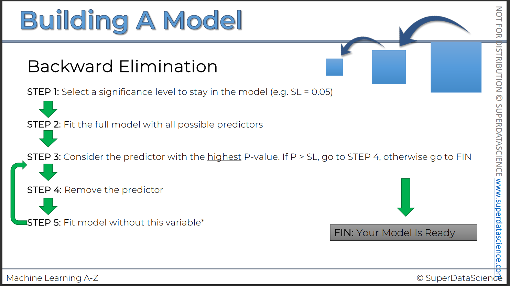
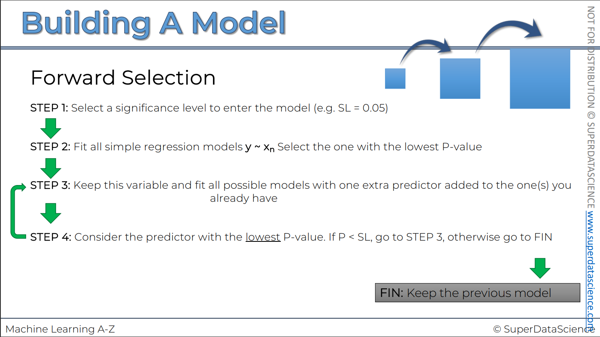
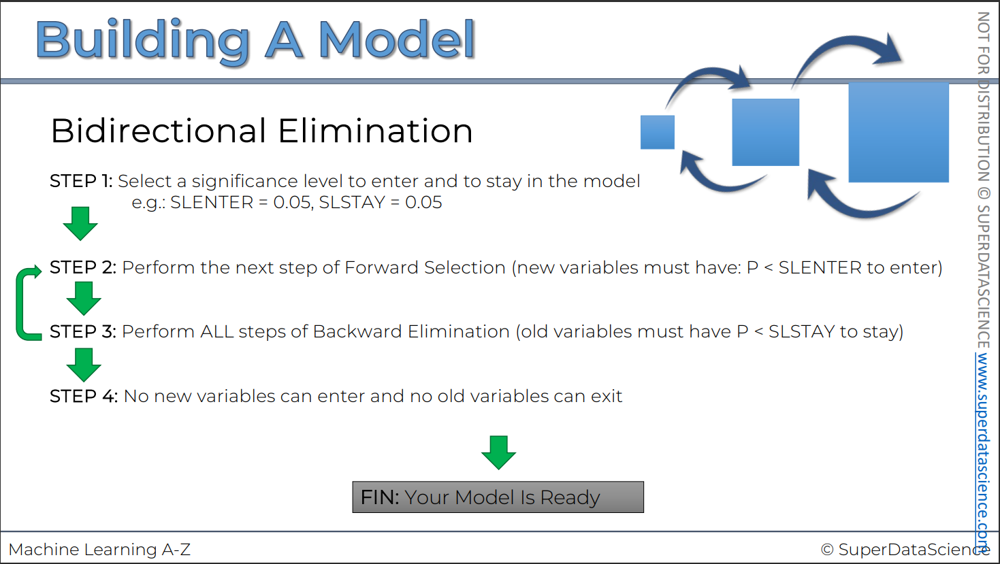
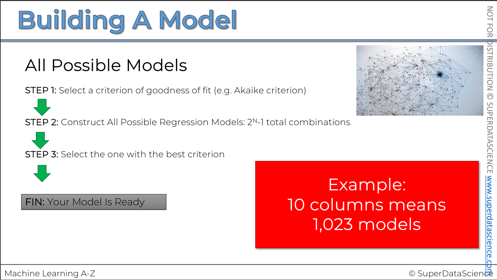

We cannot just train the model using all the variables we have, we need to only consider those which are useful to predict

Steps to build a model
1. All-in
2. Backward Elimination
3. Forward Selection
4. Bidirectional Elimination
5. Score Comparison

{2, 3, 4} are combined and called as **Stepwise Regression**

### All-in
Basically means, train the model with the all variable present

### Backward Elimination

### Forward Selection

### Bidirectional Elimination

### All possible models

