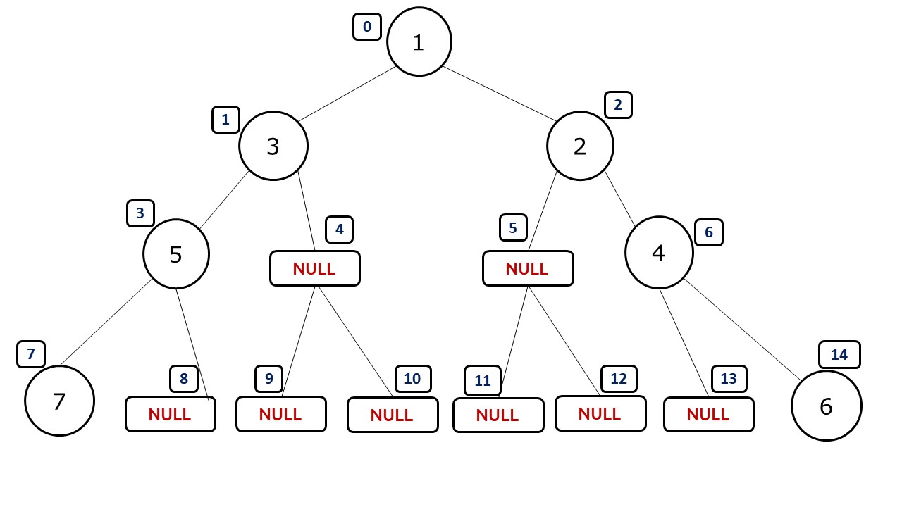
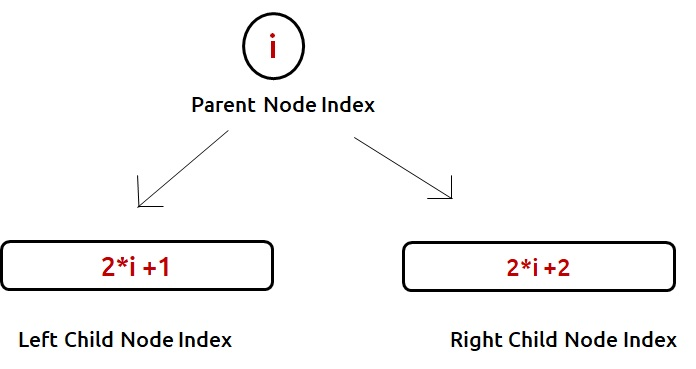
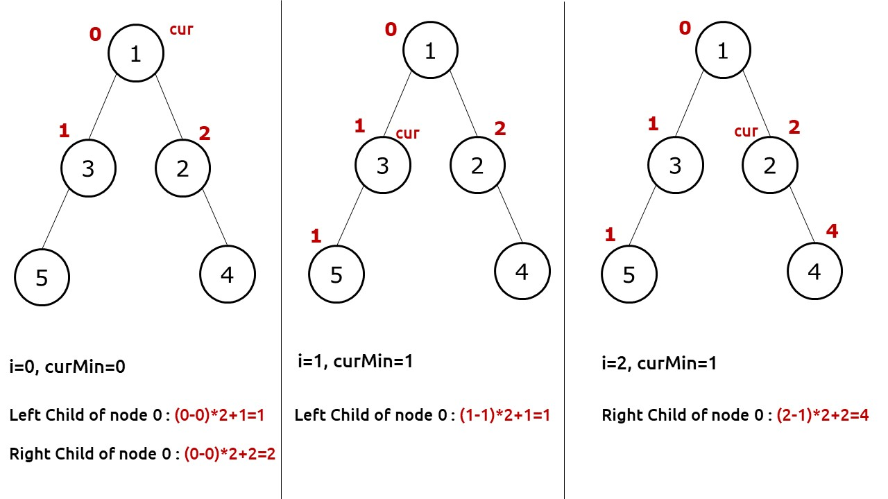

### Printing all paths from Root nodes to Leaf nodes
```cpp
// Function to perform an in-order traversal and find all paths from root to leaf nodes
void inorder(Node *root, vector<int> ds, vector<vector<int>> &ans) {
    // If the current node is null, return and backtrack
    if (root == nullptr)
        return;
    // If the current node is a leaf node (both left and right children are null)
    else if (root->left == nullptr && root->right == nullptr) {
        // Add the data of the leaf node to the path (ds) and add this path to the answer (ans)
        ds.push_back(root->data);
        ans.push_back(ds);
        return;
    }

    // Add the current node's data to the path
    ds.push_back(root->data);

    // Recursively traverse the left and right subtrees
    inorder(root->left, ds, ans);
    inorder(root->right, ds, ans);
}

// Function to find all paths from the root to leaf nodes in a binary tree
vector<vector<int>> Paths(Node *root) {
    // Initialize a vector to store the answer
    vector<vector<int>> ans;
    // Initialize an empty path (ds)
    vector<int> ds;
    // Call the inorder function to populate the answer vector
    inorder(root, ds, ans);
    // Return the answer
    return ans;
}

```

### Printing Path from root node to given node
```cpp
// Function to perform a preorder traversal and find a path from the root to a specific value 'x'
bool preorder(TreeNode *root, int x, vector<int> &ans) {
    // If the current node is null, return false to signal that 'x' was not found on this path
    if (root == nullptr)
        return false;

    // Add the current node's data to the path
    ans.push_back(root->data);

    // If the current node's data matches 'x', return true to signal that 'x' was found
    if (root->data == x)
        return true;

    // Recursively traverse the left and right subtrees
    // If 'x' is found in either subtree, return true
    if (preorder(root->left, x, ans) == true)
        return true;
    if (preorder(root->right, x, ans) == true)
        return true;

    // If 'x' is not found in the current path or its subtrees, backtrack by removing the last element from 'ans'
    ans.pop_back();

    // Return false to signal that 'x' was not found in this path
    return false;
}

// Function to find a path from the root to a specific value 'x' in a binary tree
vector<int> route(TreeNode *root, int x) {
    // Initialize a vector to store the path
    vector<int> ans;
    // Call the preorder function to search for 'x' and populate the 'ans' vector
    bool found = preorder(root, x, ans);

    // If 'x' was not found, return an empty vector
    if (!found)
        return {};

    // Return the path to 'x'
    return ans;
}
```


### Lowest Comment Ancestor
```cpp
TreeNode *lowestCommonAncestor(TreeNode *root, TreeNode *p, TreeNode *q) {
    // Base case: If the current node is nullptr (empty), return nullptr.
    if (root == nullptr)
        return nullptr;
    
    // Check if the current node is either p or q.
    if (root == p || root == q)
        return root;
        
    // Recursively search for p and q in the left and right subtrees.
    TreeNode* lf = lowestCommonAncestor(root->left, p, q); // Search in the left subtree.
    TreeNode* ri = lowestCommonAncestor(root->right, p, q); // Search in the right subtree.

    // Now, we check the results from the left and right subtrees to determine the lowest common ancestor.
    if (lf != nullptr && ri != nullptr)
        return root; // If both p and q are found in different subtrees, the current node is their lowest common ancestor.
    else if (lf == nullptr && ri != nullptr)
        return ri; // If only q is found in the right subtree, return the result from the right subtree.
    else if (lf != nullptr && ri == nullptr)
        return lf; // If only p is found in the left subtree, return the result from the left subtree.
    else
        return nullptr; // If neither p nor q are found in the current subtree, return nullptr.
}
```


### Maximum Width of Tree
Given the `root` of a binary tree, return _the **maximum width** of the given tree_.

The **maximum width** of a tree is the maximum **width** among all levels.

The **width** of one level is defined as the length between the end-nodes (the leftmost and rightmost non-null nodes), where the null nodes between the end-nodes that would be present in a complete binary tree extending down to that level are also counted into the length calculation.

It is **guaranteed** that the answer will in the range of a **32-bit** signed integer.

We can index and perform `max_index - min_index + 1` as every level to get max width at every level
- But we do indexing this way, we may hit integer overflow, thus to avoid this, we start give relative indexing





```cpp
int widthOfBinaryTree(TreeNode *root) {
    long long ans = 0; // Initialize the result variable for the maximum width.
    queue<pair<TreeNode *, long long>> q; // Create a queue to perform level-order traversal.
    q.push({root, 0}); // Push the root node and its index (initialized to 0) into the queue.

    long long min_index = 0; // Initialize the minimum index encountered so far.

    while (!q.empty()) {
        int n = q.size(); // Get the number of nodes at the current level.
        min_index = q.front().second; // Update the minimum index with the leftmost node's index.
        long long first, last; // Initialize variables to track the first and last index in the current level.

        for (int i = 0; i < n; i++) {
            TreeNode *curr = q.front().first; // Get the current node from the front of the queue.
            long long index = q.front().second - min_index; // Calculate the relative index for the current node.
            q.pop();

            if (i == 0) first = index; // Update the 'first' variable with the leftmost node's relative index.
            if (i == n-1) last = index; // Update the 'last' variable with the rightmost node's relative index.

            if (curr->left != nullptr) {
                long long new_index = 2 * (index) + 1; // Calculate the new relative index for the left child.
                q.push({curr->left, new_index}); // Push the left child into the queue with its new index.
            }
            if (curr->right != nullptr) {
                long long new_index = 2 * (index) + 2; // Calculate the new relative index for the right child.
                q.push({curr->right, new_index}); // Push the right child into the queue with its new index.
            }
        }
        ans = max(last - first + 1, ans); // Update the maximum width by comparing it with the width of the current level.
    }
    return ans; // Return the maximum width of the binary tree.
}
```

