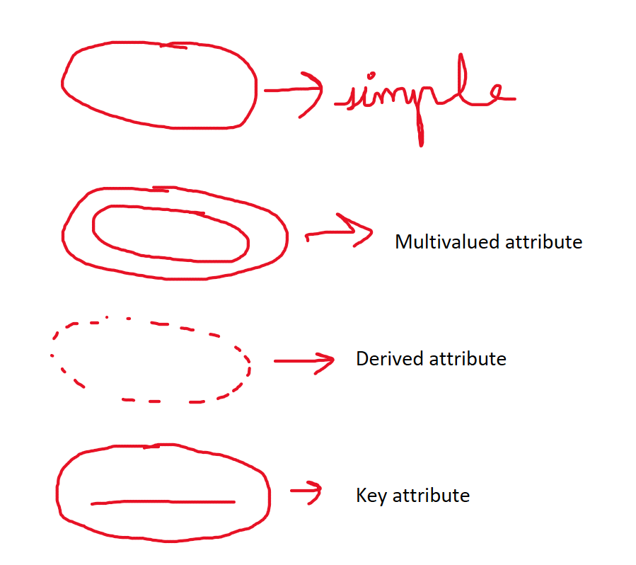
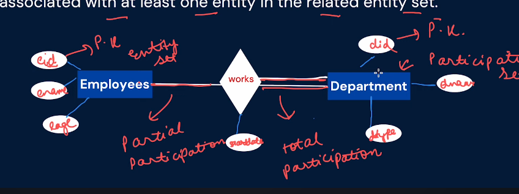
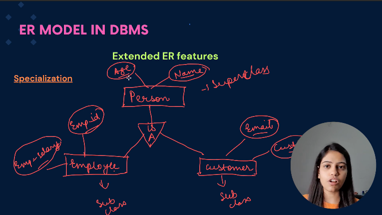
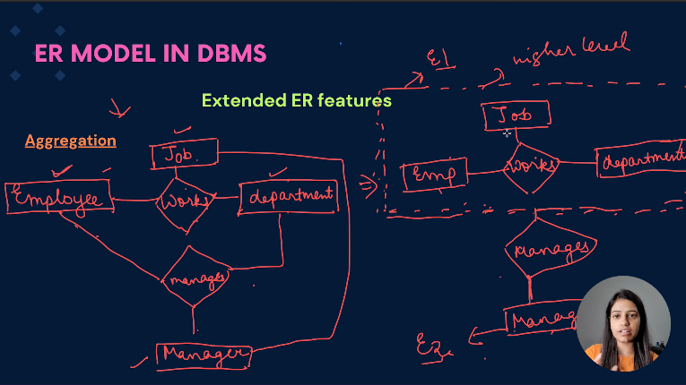

```table-of-contents
```

# data vs. information
**Data** - collection of raw facts
**information** - processed data is called information

# Database
Collection of related data
ex- table1 = [name, subject], table2 = [name, place]
	if we combine these two tables, it will be a database (collection of interrelated data [name, subject, place])


# file system
why to use DBMS when file system is already there?
1. **Data redundancy**
   There could be  various data about the same object at different paths
2. **poor memory allocation**
   point 1, leads to poor memory allocation
3. **data inconsistency**
   There could be different data about same object at different paths
4. **Data security**
   not safely stored

# Data Base Management System
A software or combination of programs to access/save/retrieve/update data

# Types of Databases
1. **Relational DBMS**
   collection of data items which have a relation among them
2. **No - SQL DBMS**
   no rules for databases, stored in *key-value* pairs (hash-maps)
3. **Object oriented DBMS**
   Data is stored in objects
4. **In-memory DBMS**
   Data is stored in primary memory (RAM), *not* in hard disk
5. **Time-Series DBMS**
   Series of events on time intervals are stored in this
6. **Spatial DBMS**
   used to store geometrics data, like coordinates
7. **Multimedia DBMS**
   contains multiple formats, like text, images, videos
8. **Columnar DBMS**
   all the data is stored in columns, (not rows)
9. **XML DBMS**
   stored in xml format
10. **New-SQL DBMS**
    bridges the gap between sql and no-sql DBMS
11. **Block chain DBMS**
    decentralized DBMS, stored in blocks

## Relational DBMS
- These databases structure data into organized tables that have predefined connections between them.
- Data manipulation and querying are performed using SQL (Structured Query Language)

## NoSQL DBMS
- these are created to store the data, that is doesn't exactly fit into RDBMS format (Mongodb)
- stored in key-value pairs

## Object-oriented DBMS
- Data is stored in objects, which are instances of a class

## In-Memory DBMS
- Data in put in primary memory, for quick retrieval
- for high-performance


# Need of DBMS
- plays vital role in businesses, institutions, and organizations
- data accuracy
- data security

## Advantages of DBMS
1. **Data security**
2. **Data redundancy and inconsistency** (we can prevent this by using DBMS)
   redundancy - storing same thing at different places
   inconsistency - data conflicts, (same thing having different values)
3. **Data integrity**
   There are some rules of DBMS, such that we cannot enter inconsistent data
4. **Data scalability** - can handle large databases
5. **Data abstraction** - Abstraction means to *hide*, DBMS offers this by allowing users to interact with data, while hiding away the underlying complexities

## Disadvantages of DBMS
1. **Cost**
2. **Scale projects** - DBMS is not needed for small applications with minimal data storage requirements
3. **Vendor lock in** - once you chose a specific DBMS, it can hard to switch to a different DBMS

# Data abstraction
Database systems are built with complex ways of organizing data. To make it easier for people to use the database, the creators hide the complicated stuff that users don't need to worry about. This hiding of unnecessary things from users is called data abstraction

## Levels of abstraction
1. **Level 1 Physical level** - This is the lowest level of data abstraction. It describes how data is actually stored in database. lets take an example, if we have a student database, then we say where a particular value is stored
2. **Level 2 Logical level** - It describes what data is stored in databases. basically creates constraints in the database, like everyone having a unique id, basically all the logical operations
3. **Level 3 View level** - Highest level of data abstraction. This level describes the user interaction with database system, ex- different viewers seeing different data, like accounts people see more data as compared to teachers in a school database

- Level 1 - Where the data is stored
- Level 2 - what data is stored 
- Level 3 - what data is shown

# Schema & Instance
## Schema
it is blueprint of the database, it is a logical container or structure that organizes and defines the structure of a database
For example
```
Customer db
1. table
2. row/column
3. give some column names and provide the datatype they can hold
4. constraints in db
```

### Types of Schema
1. **Physical schema** - A physical schema defines how data is stored on the underlying hardware, including details such as storage format, file organization, indexing methods, and data placement.
   - Primarily focuses on enhancing storage and retrieval of data to boost performance
   - Where the data is stored
2. **Logical schema** - A logical schema defines the database's structure from a logical perspective
	- **Types of logical schema**
	  1. **Conceptual schema** - represents the overall view of the entire database, a high level structure and relationships between all data elements
	  2. **External/View Schema** - represents the user specific view of the database
	- It tells how data is structured into tables / the interconnections between these tables / restrictions placed on the data

## Instance
The information residing within a database at a specific point in time is referred to as the database's *instance*

# DBMS architecture
Dbms architecture, refers to the structural framework and organization of a database management system. It defines how the various components of the system work together to store, manage, and retrieve data efficiently

Types of Architectures
1. 1-Tier
2. 2 - Tier
3. 3-Tier

## 1-Tier Architecture
The entire database application, including ui/application logic/data storage reside on a single machine or computer.

## 2-Tier architecture
Database is on a server, client makes a request and the server responds

## 3-tier architecture
In this there are 3 layers
- **Presentation layer** - it handles ui
- **Application layer** - it manages business logic, ex-server
- **Data layer** - it manages data storage and processing, ex- Database server

### Advantage of 3-tier architecture
1. Scalability
2. Modularity and Maintainability
3. Security
4. Performance

### Disadvantage
- Complexity and latency

# Data Model
It is a conceptual framework or high level view of database, whereas schema is the implementation of the database  
Basically when data model is given we can implement the schema  

## Types of Data Model
- Hierarchical data model
- Network data model
- Relational data model
- Entity-Relationship model (E-R model)
- Object-oriented data model
- NoSQL data model

## Hierarchical model
This model portrays data in a manner resembling a tree structure, a child can only have **one** parent

## Network model
Enhancement on hierarchical model, here a child can have multiple parents

## Relational model
Organizing data into tables (known as relations) consisting of rows and columns characterizes the relational model   
Rows are called as tuples, columns are called as attributes

## Entity-relation model
Utilized for crafting relational databases, the ER model represents data through entities (objects), attributes (entity properties), and relationships connecting these entities  
Ex- (student) -> entity
(name) -> attribute
(study) -> relationship

## Object-oriented model
Data stored as objects with attributes and methods fostering support for encapsulation and inheritance

## No-SQL model
Various other models such as
- Document-oriented (Mongo-DB)
- Key-value (Redis)
- Column-family (Cassandra)
- Graph (Neo 4 j)

# Data Independence
There are three levels of abstraction **View level, Logical level, Physical level**, data independence means that, even if there is some change in any of these levels, it won't affect the other levels  

# Essential components of tables
- **Row/Tuple** - rows, also known as records or tuples, represent individual entries or instances data within the table
- **Cardinality** - Number of rows in the table
- **Column/Attribute** - columns represent the attributes of the data being stored and are named to describe the information they hold
- **Degree** - No of columns in a table
- **Constraint** - constraints define the rules of conditions that must be satisfied by the data in the table (uniqueness / nullability / default values)
- **Key** 
  -> A **primary key** is a unique identifier for each record in the table. It ensures the row can be uniquely identified and accessed within the table
  -> A **foreign key** is a field in a table that refers to the primary key of another table. It establishes relationships between tables.

# Views in DBMS
View is a virtual table that is derived from one or more underlying tables. This means that it doesn't physically store data but rather provides a logical representation of data.
Ex- lets take a company db with multiple attributes, the sales team and the logistics team of the company would be interested in different attributes of the db, thus they are only showed the attributes of interest to them. Thus a virtual table is created from them from the original db

# Keys in DBMS
Keys in dbms make sure of data integrity, uniqueness, and the quick retrieval of information. Key is an attribute in table

Types of keys:
1. Candidate key
2. Primary key
3. Foreign key
4. Super key

## Candidate key
A candidate key refers to a group of attributes capable of uniquely identifying a record within a table. Among these, one is selected to serve as the primary key.

## Primary key
A primary key is a key which uniquely identifies each record in a table. It ensures that each tuple or record can be uniquely identified within the table. It is always **Unique + Not null**

## Foreign key
A foreign key is a field in a table that refers to the primary key in another table. It establishes a relationship between two tables.

Ex-> Table 1 (Base / referenced table) [roll no. , name, hometown]
Table 2 (referencing table) [roll no. , name, subject]
**Roll no. Is primary key in table 1 and foreign key in table 2**

# Referential Integrity in Foreign key
Referential integrity is to have same values for an object in all the tables, referential integrity ensures that the relationships between tables remain accurate, consistent, and meaningful within a relational database.

Lets take two tables, 1 is base/referenced table, 2 is referencing table  
Lets see how some operations like *insert*, *update* and *delete* works  

## Insertion in referenced/base table
- There will be no violation (no change) to the referencing table when we add new instances to base table

## Deletion in referenced/base table
- It may cause violation if the corresponding data is present in the referencing table

*If a record in referenced/base table is deleted or updated, the corresponding records in the referencing table should be deleted or updated to maintain the integrity of the relationship.*  
We can use CASCADE DELETE to delete from all the tables

## Updating in referenced/base table
- May cause violation if the corresponding data is present in the referencing table.
- We can use CASCADE UPDATE to update in all tables

## Insertion in referencing table
- May cause violation, lets say if the value entered in referencing table is added with a new foreign key, if that foreign key is not present in the primary key, then it will cause violation, as base table is being referenced and referencing table having additional data doesn't make sense, if the value inserted in already present in the primary key, then it won't cause violation

## Deletion in Referencing table
- No violation, it basically same as value not being added, thus it doesn't cause violation

## Updating in referencing table
- May cause violation, if we are updating foreign key, then it will cause violation


# Integrity constraints
Integrity constraints help to ensure that data remains reliable and meaningful throughout its lifecycle.

## Domain Integrity Constraint
It ensures the validity and appropriateness of data values (i.e., valid data types, ranges, and formats for columns) within a specific column or attribute of a table.  

## Entity Integrity Constraint
- It ensures that each row/record in a table is uniquely identified by a primary key.  
- It also helps in preventing duplicate or null values in the primary key.

## Referential Integrity Constraints
It ensures that values in a foreign key column match with the values in the corresponding primary key column in another table.

## Key Constraint
It ensures uniqueness for the primary key. It makes sure that atleast one primary key exists in the table

## Check Constraint
- It checks for a condition that each row in a table must satisfy.
- If the condition is not met, the insertion or update of the row is rejected.

## Null Constraint
Determines whether in a column in a table can have null or not

## Uniqueness Constraint
Checks if the values in a column or group of columns to be unique

## Default Constraint
It sets a default value of the column, it is used when no other value is provided

# Super key
- It is a set of one or more attributes (columns) that can uniquely identify a tuple (a row) in a relation (table).
- Superset of any candidate key
- A super key becomes a candidate key if it is minimal (i.e., no proper subset of it can uniquely identify a tuple)
- A candidate key is minimal super key

# ER model
Entity-Relationship model
- Entity - Things/object (Person)
- Attributes - Properties of entity (name, age)
- Relationships - Associations among entitles (Works for)

- ER model stands as a prevalent conceptual modeling approach with in the realm of database design
- It's primary role is to offer a visual representation of the database architecture by showing their entities, attributes and interconnections among them


| Figures          | Purpose                          |
| ---------------- | -------------------------------- |
| Rectangle        | Entity                           |
| Ellipse          | Attribute                        |
| Diamond          | Relationship                     |
| Line             | Attribute to entity relationship |
| Double Ellipse   | Multivalued attribute            |
| Double rectangle | Weak entity                      |


## Entity
Entity is some object that has some features to describe it

Types of entity
1. Strong (independent)
2. Weak (dependent of other entity)

### Strong Entity
A strong entity is an entity that has its own unique identifier (**primary key**) and is not dependent on any other entity for its existence within the database.

### Weak Entity
A weak entity is an entity that doesn't have a primary key of is own. It relies on a related strong entity (known as the "owner") for its identity.

## Attributes
Attributes are features of entity

Types of attributes

### Simple attribute
It is an atomic attribute which cannot be subdivided

### Composite Attribute
A composite attribute is made up of several smaller attributes

### Single valued attribute
As the name suggests, it hold a single value for each entity

### Multivalued attribute
It can hold multiple values for the entity

### Stored attribute
Attribute that is stored as a part of a database record

### Derived attribute
A derived attribute is derived from other attributes within the database

### Complex attribute
It is made up of multiple smaller attributes

### Key attribute
An attribute that can uniquely identifies the records in the table (its always unique)



## Relationships in ER model
Relationship in ER model is the connection between entities (tables) based on related data

### Strong relationship
Two highly dependent entities have strong relationship, **one can't exist without the other**

### Weak relationship
When two entities are related but one cannot exist without the other

## Degree
Number of attributes/columns that a relation/table has

**Types of degree**
1. Unary degree (relation with a single attribute)
2. Binary degree (relation with two attributes)
3. Ternary degree
4. N-ary degree

## Types of relations (cardinality)
[table 1] --- [relationship] --- [table 2]
Relationship is its own table

### One - to - one relation
In this type of cardinality mapping, an entity in A is connected to at most one entity in B. Or we can say that a unit or item in B is connected to at most one unit or item in A.

- In one-to-one relation, relationship table can merged in one of the two tables
- Relationship table contains, primary key of both the tables and the relation attribute (what the relation stands for)
	- For ex- in student and course table, relationship could be Enrolls, thus relationship table contains, **student_id, course_id, enroll_month** (considering that one student can only take one course)
	- Either course_id or student_id could be the primary key in relationship table
- Either of the foreign key in the relationship table could be the primary key

### One-to-Many relation
As the name suggests, one entity in one table is associated with many entities in another table  
For example -   
- Author entity and book entity and relationship is *writes*, relationship attribute is publishing date  
- Author id is primary key (in author table) and similarly book id the primary key (in book table)
- Relationship table contains [author id, book id, publishing date]
	- In these 3 attributes *author id*(foreign key) is repeated many times and 1 author can write many books
	- *book id* is unique as, one book can only be written by one author, thus this is the primary key of the relationship table
- **In One-to-Many relation, primary key in the relationship table is from the 'many' side**
- Tables can be combined, we can put *author id* in book table as a foreign key, basically we can merge `one table` with `many table`

### Many to Many relationship
Each entity in table 1 is associated with many entities in table 2 and also each entity in table 2 is associated with many entities in table 1  
- Since this is many-to-many, both the foreign keys repeat in the relationship table, thus we won't have a primary key, thus we combine both the foreign keys to make a primary key, this primary key is called as composite key
- Tables cannot be reduced

## Participation Constraints
Participation constraints in an ER model define whether every entity in one group must be connected with at least one entity in another or if the connection is optional.

### Total  Participation (Mandatory)
In a total participation constraint, each entity in a participation set must be associated with at least one entity in the related set.

### Partial Participation
Entities in the participating entity set may or may not be associated with entities in the related entity set.


`=======` means **Total participation**   
`------` means **Partial participation**   

# Extended ER features
Today the complexity of the data is increasing so it becomes more and more difficult to use the traditional ER model for database modeling. To reduce this complexity of modeling we have to make improvements or enhancements to the existing ER model to make it able to handle the complex application in a better way. 

Enhanced entity-relationship diagrams are advanced database diagrams very similar to regular ER diagrams which represent the requirements and complexities of complex databases.  

## Specialization
Lets take a person entity, say the person is an employee, student, customer, thus that person entity has many attributes, to simplify this, we create sub classes like employee entity, student entity, customer entity, they will have own unique attributes and inherit some common attributes from person entity   

Specialization in the ER model is like categorizing entities based on common features  

A `Supertype` groups entities with shared attributes and relationships, while `Subtypes` have their own unique attributes and relationships. Its a way to organize data efficiently. It is a **Top-Down approach**   

We have **is-a** relationship between super class and sub class   

As per the example, student is-a person, customer is-a person, employee is-a person   



## Generalization
Generalization is like finding things that are alike and putting them into a big group to represent what they have in common. It helps make things simpler and organized.   

It is a **Bottom-Up approach**   

We have **is-a** relationship between subclass and superclass   

Lets say we *student* and *employee* we group common attributes among them and create *person*, opposite of specialization

## Inheritance
- **Attribute Inheritance** if parents has some attributes, then child will also get those attributes
- **Participation inheritance** if parent participates in some relationships, then child will also participate in those relationships

## Aggregation
Aggregation is like stacking things on top of each other to create a structure. It is used to create a hierarchical structure in data modeling, showing how a higher-level entity is composed of lower-level entities.   

**Abstraction** is employed to view relationships from a more general perspective focusing on a higher-level entity.


Basically manager has relations with multiple entities, all those entities are stacked to form a higher level entity with which manager has relationship with.

# Relational Model
- **Table** - Relation
- **Row** - Tuple
- **Column** - Attribute
- **Record** - Each row in a table
- **Domain** - The type of value an attribute can hold
- **Degree** - Number of columns in a relation (table)
- **Cardinality** - number of tuples (rows)
In ER model, cardinality is the type of relation (i.e., 1-1, 1-N, N-1, N-N), but in relational model it is number of rows   

**Relational model is all about:**
1. Data being organized into tables
2. Establishing relations between tables using foreign key
3. Maintaining data integrity
4. A flexible and efficient way to store (SQL) and retrieve data

In relational model we take care of different things like:   
1. Maintaining integrity constraints like domain, entity, referential integrity
2. The values should be atomic (i.e., can't be divided further)
3. Each row must be unique, here keys comes into picture

## Converting ER model to Relational model
1. **Identify the entities** - List down all the entities like strong and weak
2. **Identify the attributes** - For each entity, identify its attributes which becomes a column in the table
   Since values in a table need to be atomic
   - **Composite attribute**
     We store the simple attribute of this composite attribute and discard composite attribute all together, ex- we store `first name` and `last name`, and discard `name` which is made of `first name + last name`
   - **Multivalued attribute**
     Lets take phone number, it is multivalued, primary ph no., secondary ph no., in first table we can have all the attribute and primary ph no., in second table we can have just the primary key and secondary ph no.,
3. **Key selection** - Choose the primary key for each table it can be in form of composite key (weak entity)
4. If entities have relationship break it down and reduce the tables if possible.

| Relation | Tables | Primary key in relation table |
| -------- | ------ | ----------------------------- |
| 1-1      | 2      | any side                      |
| 1-N      | 2      | many side                     |
| N-1      | 2      | many side                     |
| N-N      | 3      | Combination of both the keys  |

